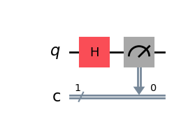
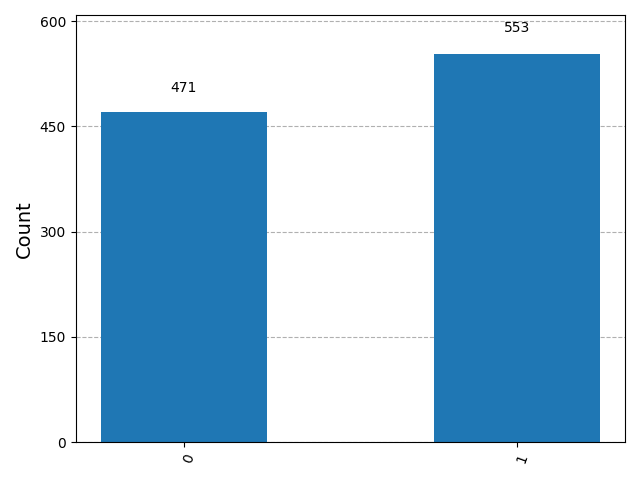

<<<<<<< HEAD


# Quantum Circuit Simulation with Qiskit

Hi, I'm Sumith Reddy, and this is my quantum computing demo project using Qiskit!

This project visually demonstrates two foundational quantum computing concepts:

- **Single Qubit Superposition**
- **Bell State Entanglement**

It includes code, circuit diagrams, probability histograms, and clear explanations—perfect for beginners and for showcasing on GitHub.

---

## 🚩 Problem Statement

How do you visualize and understand the core ideas of quantum computing? This project answers that by:

- Creating and simulating quantum circuits in Python
- Showing how superposition and entanglement work
- Visualizing quantum measurement results

---

## 🧠 Quantum Concepts Demonstrated

### 1. Single Qubit Superposition
|0⟩ → Hadamard Gate → Measurement

The Hadamard gate puts a single qubit into a superposition, so measurement yields 0 or 1 with equal probability.

### 2. Bell State Entanglement
|00⟩ → H ⊗ I → CX → Measurement

Two qubits are entangled so their measurements are always correlated (00 or 11).

---

## 🗂️ Project Structure

```text
quantum-circuit-simulation-qiskit/
│
├── main.py              # Main Python script (circuit creation, simulation, visualization)
├── requirements.txt     # Python dependencies
├── README.md            # Project overview and instructions
└── screenshots/         # Output images (circuit diagrams, histograms)
```

---

## 📸 Screenshots

<p align="center">
  
  
</p>

---

## 🚀 How to Run

1. **Install dependencies:**
   ```bash
   pip install -r requirements.txt
   ```
2. **Run the demo:**
   ```bash
   python main.py
   ```

---

## 📝 What You’ll See

- Quantum circuit diagrams (auto-generated)
- Probability histograms of measurement results
- Terminal output showing measurement counts

---

## 🛠️ Technology Stack

- Python 3.8+
- Qiskit (IBM Quantum)
- Matplotlib (for visualization)

---

## ⭐ Why This Project?

- Clean, beginner-friendly code
- Visual output for easy understanding
- Great for resumes, portfolios, and learning quantum basics

---

> After running, upload your screenshots to the `screenshots/` folder and push to GitHub for a visually impressive README!

> After pushing to GitHub, add screenshots of your circuit and histogram outputs to the `screenshots/` folder for a more impressive README.
=======
# quantum-circuit-simulation-qiskit
>>>>>>> 9d4a649aed1d551daace47827859a91cfd497912
